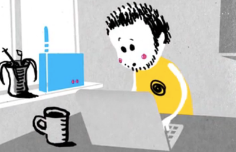

## Geschichte

* Erste Schritte 2000/2001
* freifunk.net seit 2003
* Zwischenhoch 2007
* starkes Wachstum ab 2012

--

## Adhoc Networking

--

## Szenarien

* Einsteiger - Router im Fensterbrett

--

## Szenarien

* Fortgeschritten
 * hohe Gebäude
 * Balkon

--

## Szenarien

* Backbone
 * Kirchtürme
 * exponierte Standorte

Note:

 wird gemeinsam geplant, aufgebaut und gewartet

 Richtfunkverbindungen

--

## OLSR

* Layer 3
* jeder Router kennt Topologie
* aufwändigere Netzkonfiguration

--

## B.A.T.M.A.N.

* Layer 2
* einfache Netzkonfiguration
* viel Multicasttraffic
* Geschichte der beiden Protokolle: https://youtu.be/LW_q4dIwkSE?t=1h2m7s

Note:

wie ein großer Switch

in Berlin: Kombination beider Alternativen

--

## VPN

* zur Verbindung von Meshwolken
* wegen Störerhaltung
* IntercityVPN

Note:

1. openvpn, fastd, vtun
2. BGP für ICVPN

--

## Services

* mehr als nur Internet
* Selbst Dienste anbieten und ausprobieren
* Lernen
* Dienste unabhängig von Providern
